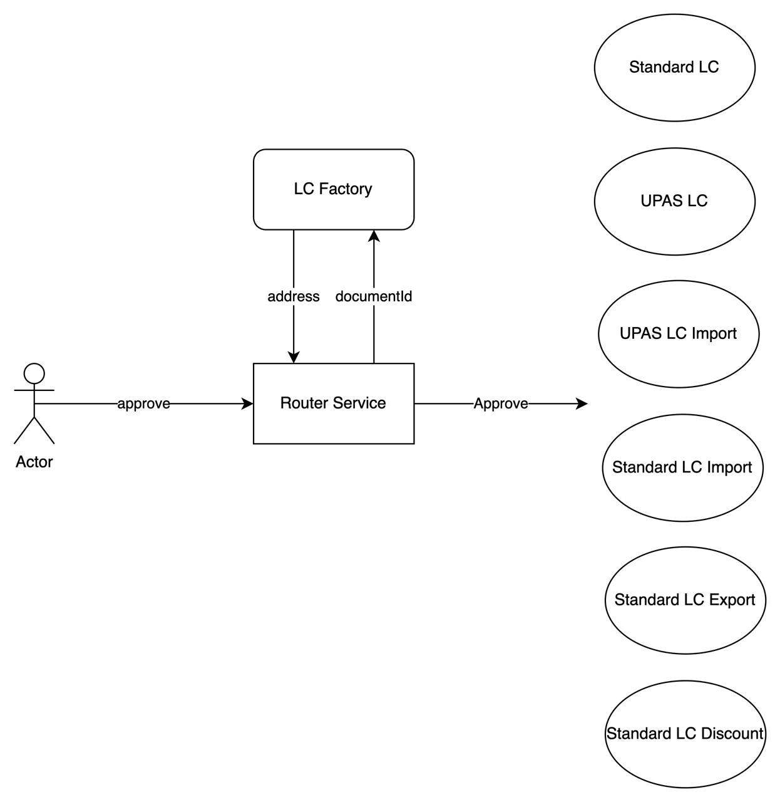

# LC Platform - Smart Contracts

<p align="center">
  
</p>

Về mặt quản lý và kiến trúc tổng quan, thì hệ thống các smart contract sẽ được chia thành 2 groups phục vụ cho những layer riêng biệt:

- Permission Layer sẽ có các smart contracts được cung cấp nhằm phục vụ cho việc Nodes/Accounts Service Management
- LC Application Layer sẽ có các smart contracts được tạo ra nhằm phục vụ cho các hợp đồng LC

- Theo dự định ban đầu, Permission Layer và LC Application Layer sẽ được tách riêng để dễ dàng cho việc scalability và cung cấp thêm những features khác mà
  không ảnh hưởng đến Permission Layer

  - Node Service: Fullnode/RPC client để sync-up data và gửi transaction request
    - Ví dụ: Ngân hàng A sẽ có Node Service A1, A2, A3; FPT Platform có Node Service F1, F2, F3, F4
  - Account Service: những account/address sẽ tương tác với LC Platform smart contracts
    - Ví dụ: Doanh Nghiệp D - Account Service D1 và Ngân hàng A - Account Service A1, A2, A3 (đồng thời là Node Service)
  - Doanh nghiệp/Ngân hàng hoàn toàn có thể có những Account Service mà không cần phải đăng ký Node Service
  - Smart contracts ở LC Application Layer hoàn toàn không bị phụ thuộc vào Genesis contracts ở Permission Layer

- Tuy nhiên, dựa theo cơ chế quản lý của Quorum thì tất cả các accounts/nodes đều cần được đăng ký và quản lý bởi Admin của hệ thống để có thể thực hiện những
  tác vụ trong hệ thống blockchain (event listener, send/receive txs, deploy contracts). Nếu dùng cách thiết kế như dự định ban đầu sẽ dẫn đến tình trạng
  duplicate settings/tasks không thật sự cần thiết. Do đó, ở thời điểm hiện tại có thể sử dụng Permission Layer cho việc quản lý nodes/accounts cho cả hai mà
  không cần tách riêng. Nếu như nhu cầu trong tương lai đòi hỏi những yêu cầu khác thì có thể cân nhắc việc thêm extension contracts

## LC Platform

<p align="center">
  
</p>

- LC Platform (smart contracts) được chia ra thành 2 modules chính:
  - LC Platform Core: cung cấp những chức năng như Quản lý (management) và Dịch vụ (Utils/Services). Module này bao gồm:
    - Permission Management: là các smart contracts kế thừa từ Quorum cho việc quản lý (management)
    - Service: `Router Service`, `LC Factory`
  - LC Contracts:
    - Là hệ thống tập họp các hợp đồng LC của các bên liên quan Cá Nhân/Doanh Nghiệp - Cá Nhân/Doanh Nghiệp - Ngân hàng
    - Được tạo ra bởi `LC Factory`

### LC Platform Core

- LC Platform Core bao gồm các contract sau:
  - Permission Management: quản lý toàn bộ tổ chức và special roles trong LC Platform (kế thừa từ Quorum)
    - Hiện tại sẽ có 3 loại tổ chức: NETWORK_ADMIN, BANKING và CORPORATION
      - NETWORK_ADMIN: giữ nhiệm vụ quản lý toàn bộ hệ thống
        - Có quyền thêm hoặc loại bỏ tổ chức (organization)
        - Có quyền assign `ADMIN_ROLE` cho một tổ chức
        - Có quyền add thêm Node Service
        - Có quyền add/remove blacklist
      - BANKING:
        - Là một loại tổ chức trong hệ thống
        - Được tạo ra bởi `NETWORK_ADMIN`
        - Mỗi Ngân hàng sẽ có một tổ chức của riêng mình để quản lý các account thuộc hệ thống của ngân hàng đó
        - Mỗi tổ chức ngân hàng sẽ được cho phép một hoặc nhiều `ADMIN_ROLE` để quản lý tổ chức
        - `ADMIN_ROLE` có quyền thêm `Sub Org` và special roles trong hệ thống tổ chức đang quản lý
      - CORPORATION:
        - Là một loại tổ chức trong hệ thống
        - Mỗi doanh nghiệp sẽ cần đăng ký ít nhất một account
        - `NETWORK_ADMIN` add thêm tổ chức và đồng thời assign role cho account
  - LC Factory:
    - Là contract phục vụ cho việc khởi tạo các `UPAS LC`, `UPAS_LC_IMPORT`, `Standard LC`, `STANDARD_LC_DISCOUNT`, `STANDARD_LC_EXPORT`, `STANDARD_LC_IMPORT`
    - Có giới hạn ai là người được khởi tạo `UPAS LC`, `UPAS_LC_IMPORT`, `Standard LC`, `STANDARD_LC_DISCOUNT`, `STANDARD_LC_EXPORT`, `STANDARD_LC_IMPORT`
  - Router Service:
    - Cung cấp các giao thức để Ngân hàng, Cá nhân/Doanh nghiệp (được cấp role) có thể tương tác với các hợp đồng `UPAS LC`, `UPAS_LC_IMPORT`, `Standard LC`,
      `STANDARD_LC_DISCOUNT`, `STANDARD_LC_EXPORT`, `STANDARD_LC_IMPORT`

### LC Contracts

- `UPAS LC`, `UPAS_LC_IMPORT`, `Standard LC`, `STANDARD_LC_DISCOUNT`, `STANDARD_LC_EXPORT`, `STANDARD_LC_IMPORT`:
  - Là các hợp đồng giao dịch giữa các bên liên quan Cá nhân/Doanh Nghiệp - Cá nhân/Doanh Nghiệp - Ngân hàng
  - LC Contract khi khởi tạo cần phải thiết lập các thông tin organizations có liên quan trong LC này
  - Mỗi hợp đồng sẽ có các `stage` quy định khác nhau. Một hợp đồng sẽ có các điểm sau:
    - Nội dung của hợp đồng và các chứng từ liên quan sẽ được cung cấp giao thức để truy xuất
    - Nội dung sẽ được lưu off-chain nhưng tính chất consistent, integrity và unalterable sẽ được bảo đảm
    - Các bên tham gia đồng ý với các điều khoản, thông tin trong hợp đồng
    - Khi có bất kỳ thay đổi -> `UPAS LC`, `UPAS_LC_IMPORT`, `Standard LC`, `STANDARD_LC_DISCOUNT`, `STANDARD_LC_EXPORT`, `STANDARD_LC_IMPORT` cần phải khởi tạo
      lại và các quá trình xác nhận cần thực hiện lại từ đầu
    - Hợp đồng thành công và hoàn thành khi tất cả các `stage` trong hợp đồng được `approved`
    - Hợp đồng cần được hoàn thành đúng thời hạn (TBA)

## Stages and Integrity

<p align="center">
  
</p>

<p align="center">
  
</p>

Hiện tại, có 2 loại LC chính là - `Standard LC Contract` và `UPAS LC Contract` và `UPAS_LC_IMPORT`, `STANDARD_LC_DISCOUNT`, `STANDARD_LC_EXPORT`,
`STANDARD_LC_IMPORT`

- `Standard LC Contract`, `STANDARD_LC_DISCOUNT`, `STANDARD_LC_IMPORT` sẽ không có NHTT (Reimbursing Bank) và chỉ có 6 stages
- `UPAS LC Contract`, `UPAS_LC_IMPORT` sẽ có thêm NHTT và có tổng cộng là 7 stages
- `STANDARD_LC_EXPORT` chỉ có 5 stages
- Stage 1 sẽ chỉ có một sub-stage duy nhất (1.1)
- Đối với Stage 2-6/2-7 thì sẽ không giới hạn số lượng sub-stage. Nghĩa là việc cung cấp bộ chứng từ và đưa `hash(content)` lên on-chain sẽ không giới hạn số
  lần.
- Có một điều kiện: cần tuân theo trình tự
  - Stage 3.1 cần phải theo sau 2.1.
  - Không cho phép 2.1 <- 4.1
  - Không cho phép 2.1 <- 3.2
  - Không cho phép 2.2 có trước 2.1

### Stages là gì?

- Đối với BE:
  - Lưu những thông tin cần thiết và chi tiết của stage đó
  - Thông tin lưu ở mỗi stage là khác nhau
  - Lưu dưới dạng JSON
- Đối với trên contract:
  - Hash của stage trước đó
  - Hash info của stage
  - URL link để có thể lấy được JSON (lưu ở BE)
  - Chữ ký signature (metamask) xác nhận các thông tin đã lưu ở trên
    - Từ chữ ký có thể xác định account đã dùng để ký
    - Xác nhận xem account đã ký và cung cấp thông tin có đúng trong tổ chức đã được thiết lập trong LC và đồng thời là tổ chức cần xác nhận thông tin ở một
      stage cụ thể. Ví dụ: Stage 2.1 yêu cầu AdvisingBank - Bank A sẽ cung cấp chứng từ và xác nhận thông tin -> chỉ cho phép Account thuộc tổ chức Bank A được
      quyền đưa thông tin lên LC
    - Bảo đảm nội dung đưa lên và nội dung đã được ký là trùng khớp
    - Account đã dùng để ký xác nhận thông tin và người gửi thông tin lên contract cần phải giống nhau

Lưu ý:

- Chỉ cần nội dung thông tin đưa lên contract bị thay đổi không khớp với nội dung đã được ký -> Fail
- Người ký xác nhận thông tin và người đưa thông tin lên LC không trùng khớp -> Fail
- Về Account đã dùng để ký và đưa lên on-chain không lưu một các trực tiếp, nhưng thông qua chữ ký có thể xác định được Account đã dùng để ký

```solidity
struct StageInfo {
  bytes32 prevHash;
  bytes32 contentHash;
  string url;
  bytes signature;
}
```

### Integrity

- Khi đưa thông tin xác nhận on-chain, Stage cần ở trạng thái `unset`
- Không cho phép update thông tin của một Stage sau khi đã thiết lập. Nếu có, request sẽ tự động bị reject -> fail
- Tất cả các request đưa thông tin xác nhận lên on-chain cần theo sequence order
  - Stage 1 <- Stage 2.1 <- Stage 3.1 .....
  - Không cho skip stage 1.2 <- 2.1 <- 4.1
  - Stage 1 chỉ có duy nhất một sub-stage (Stage 1.1)
  - Không cho phép skip sub-stage (Stage 2.2 có trước Stage 2.1)
  - Không cho phép confirm chéo sub-stage (2.1 <- 3.2; 2.2 <- 3.1)
- Stage Info: `prevHash`, `contentHash`, `url`, `signature`
  - `stage_hash = hash(prevHash, contentHash, url, signature)`
  - `prevHash` trong Stage 2.1 sẽ là `stage_hash` của Stage 1.1
  - `prevHash` của Stage 1.1 là gì?
- Trong LC Contract sẽ lưu `stage_hash -> stage_number`. Do đó, sẽ dễ dàng checking thông tin `prevHash` đưa lên ở một Stage bất kỳ có liên kết với Stage trước
  đó hay không

<p align="center">
  
</p>

### Đưa thông tin lên LC Contract

<p align="center">
  
</p>

- Khi `Standard LC Contract` hoặc `UPAS LC Contract` được tạo ra, request này sẽ đi kèm với `documentId`. Đây cũng chính là `prevHash` của Stage 1.1
- Theo như design ban đầu, `documentId` được tạo ra từ hash của thông tin hợp đồng giữa Applicant - Beneficiary. Thông tin này sẽ được lưu trên một contract
  on-chain. Scope này đã bị cắt bỏ
- `Standard LC Factory` và `UPAS LC Factory` sẽ lưu một mapping `documentId -> address_of_lc_contract`
- User khi approve và đưa thông tin cập nhật lên LC Contract sẽ cần cung cấp:
  - documentId
  - stage + sub-stage
  - prevHash
  - contentHash
  - url
  - signature
- Sau đó, `Router Service` sẽ có nhiệm vụ look-up LC Contract tương ứng với `documentId` thông qua việc liên lạc với 2 Factory contract để trả về address của LC
  Contract
  - Nếu như không tìm thấy address -> Fail (vì documentId không tồn tại)
  - Nếu có -> thông tin sẽ được chuyển sang LC Contract để giải quyết
- LC Contract có nhiệm vụ kiểm tra về thông tin cũng như là kiểm tra quyền gửi thông tin approve của account người gửi.
  - Nếu người gửi và tất cả thông tin là hợp lệ thì sẽ lưu vào contract
  - Ngược lại -> Fail

## Những issue trong phiên bản draft hiện tại

1. Smart contract/blockchain là nơi lưu trữ để đối chứng nhưng lại thiếu minh bạch trong vấn đề xác nhận và xác thực

- `Standard LC Contract` hay `UPAS LC Contract` liên quan đến các bên tham gia trong một bản hợp đồng và thanh toán: Doanh nghiệp/Cá nhân - Doanh Nghiệp/Cá
  nhân - Ngân hàng. Theo như thiết kế tương tác hiện tại thì chỉ có tổ chức ngân hàng là tương tác với LC Contract cho việc xác nhận và đồng thuận (confirm and
  approve). Thông tin đưa lên contract đều đươc thực hiện bởi một cá nhân/tổ chức nhưng lại không có sự xác thực ở đối tượng liên quan chính của một hợp đồng
  (Applicant/Beneficiary)
- LC Contract được tạo ra khi Ngân hàng đồng thuận cung cấp tín dụng cho vay cho một Doanh Nghiệp/Cá nhân dựa trên hợp đồng mua bán giữa Applicant và
  Beneficiary. Như thiết kế ban đầu thì hợp đồng giữa Applicant và Beneficiary sẽ được đưa lên smart contract để lưu thông tin. Khi Ngân hàng xác nhận và đồng
  thuận sẽ tạo LC Contract và liên kết với hợp đồng này. Tuy nhiên, vì đơn giản thiết kế ở thời điểm hiện tại và hạn chế việc tương tác của các Doanh nghiệp/Cá
  nhân với hệ thống, bước đưa hợp đồng lên smart contract đã bị cắt bỏ. Việc cắt bỏ này vi phạm nghiêm trọng đến những quy tắc trong blockchain - authenticity
  và integrity

2. Time constraint

- Mỗi hợp đồng đều có những thông tin: Ngày soạn thảo và Ngày hết hiệu lực. Đối với smart contract cũng sẽ có cơ chế tương tự. Thời điểm smart contract có hiệu
  lực thông thường được mặc định là thời điểm smart contract được tạo ra. Tuy nhiên, thời gian hiệu lực của LC Contract là hoàn toàn không có giới hạn. Dẫn đến,
  những thông tin lưu trữ ở trên LC Contract có thể được đưa lên không giới hạn -> vấn đề về time constraint

3. Tính pháp lý

- Văn bản truyền thống thường dựa trên chữ ký và con dấu để xác nhận thông tin và được pháp luật bảo vệ. Tuy nhiên, điều này lại không thể áp dụng trong
  blockchain được
- Thay vào đó, smart contract/blockchain dựa trên thuật toán để giải quyết vấn đề chữ ký xác nhận và xác thực. Điều này về mặt pháp lý thì vẫn chưa có được sự
  chấp nhận
- Do đó, nên kết hợp cả hai để có thể minh bạch và rõ ràng. Ở một số bước, Doanh nghiệp/cá nhân cần vào xác nhận thông tin đã được đưa lên bởi Ngân hàng
