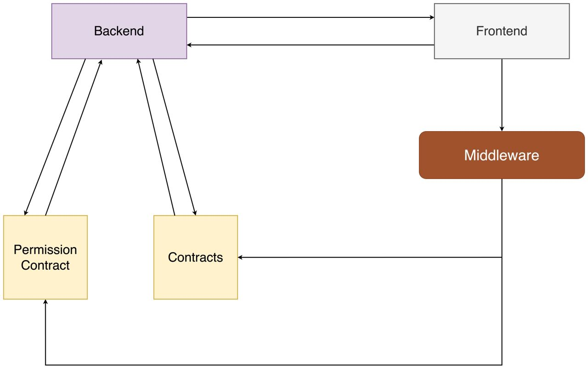

# FIS Overview Architecture

- Back-end tương tác trực tiếp với Permission Contracts và LC Contracts để thực hiện các thao tác:
  - Check permission org, account role ...
  - Thực hiện generate acknowledge message hash, approval message hash.
  - Thực hiện generate data cho các bước tạo LC, update LC, amend.
- Front-end tương tác với Back-end để lấy được các thông tin cần thiết cho các bước tạo LC, update LC, amend và sau khi đã có đầy đủ thông tin cần thiết thì
  Front-end sẽ tương tác trực tiếp với Middleware để thực hiện các thao tác trên.
- Middleware đóng vai trò trung gian giữa Front-end và LC Contracts để thực hiện các bước tạo LC, update LC, amend... và ngoài ra tương tác với Permission
  Contracts để thực hiện check lại các thông tin về permission của account đang dùng để tương tác trong network của FIS.
