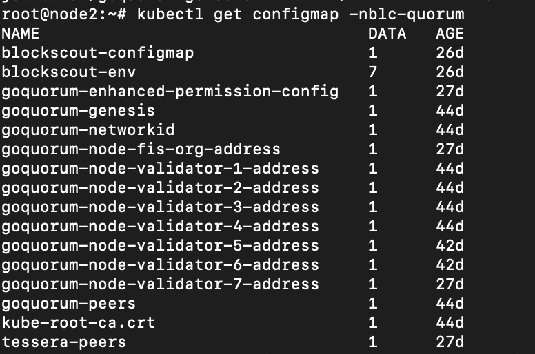
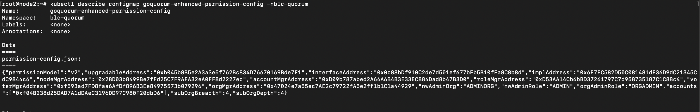

**Get permission config:**

Access to FIS node via SSH: ssh @11.11.111.1 (example) Get all configmap in namepsace blc-quorum: **kubectl get configmap -nblc-quorum**

Describe configmap goquorum-enhanced-permission-config: **kubectl describe configmap goquorum-enhanced-permission-config -nblc-quorum**

