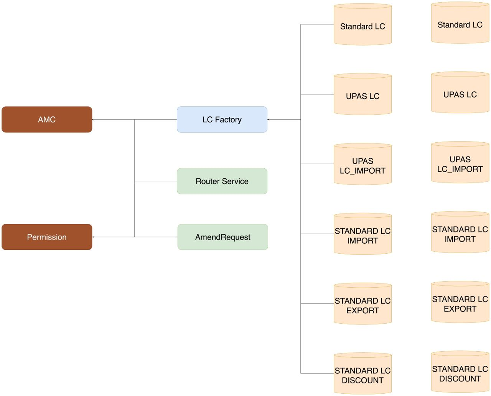

## LC Platform Management

  

- The LC Platform includes 8 smart contracts that are separated in 3 modules:
  - Management: `AMC` (Address Management Contract) and `Permission` (by Quorum)
  - DBMS: a collection of LC contracts - `Standard LC` and `UPAS LC` contracts
  - API: external contracts, including `StandardFactory`, `UPASFactory`, `AmendRequest` and `RouterService`, that provide accessibility to the DBMS and othersf

Let's discuss about hierarchy of management

### Roles and Hierarchy of management

- The Management module consists of two contracts:
  - Address Management Contract (`AMC`): manages the address of smart contracts in the LC Platform
    - `Permission` Contract's address
    - `Router Service` Contract's address
    - `Amend Request` Contract's address
    - `Standard Factory` Contract's address
    - `UPAS Factory` Contract's address
  - Permission Interface (`Permission`): provided by Quorum to manage eligible EOAs and Organizations
    - There are three roles - `Network_Admin`, `Admin_Org`, and `Member`
      - `Network_Admin`: the most powerful role (Top Gun) in the LC Platform
        - Be able to register/un-register a new organization
        - Be able to grant/revoke `Admin_Org` role
        - Be able to set/update address of smart contracts which is configured in the `AMC`
        - Be able to set/update the address of `AMC` in other contracts, i.e. `Router Service`, `Amend Request`, `Standard Factory`, and `UPAS Factory`
      - `Admin_Org`: assigned by `Network_Admin` which takes responsibility in managing his/her organization
        - Be able to register/un-register `Member` role
        - Has a feature role as `Member` in the organization
      - `Member`: the least powerful role in the LC Platform. This role is allowed:
        - Create a LC contract (Standard/UPAS)
        - Approve Stage in a LC Contract
        - Submit a request to amend one LC contract
        - Approve an amendment request
        - Execute an amendment request
        - Close a LC contract (Restricted to only members of `Management_Org`)
    - There are also three types of organization
      - `Network_Admin_Org`: defined by Quorum, adding new `Network_Admin` requires a voting mechanism
      - `Management_Org`:
        - A special organization that is granted a priviledge for a special task, i.e. closing LC contracts
        - `Member` of this organization is authorized to close any LC contracts
      - `Organization`: a regular type of organization, i.e. Bank Organization, Corp. Organization
- The API module:
  - `LC Factory`:
    - Manage a collection of `UPAS LC`, `UPAS_LC_IMPORT`, `Standard LC`, `STANDARD_LC_DISCOUNT`, `STANDARD_LC_EXPORT`, `STANDARD_LC_IMPORT` contracts
    - Record the address of `AMC` -> each of `UPAS LC`, `UPAS_LC_IMPORT`, `Standard LC`, `STANDARD_LC_DISCOUNT`, `STANDARD_LC_EXPORT`, `STANDARD_LC_IMPORT`
      contracts can easily update/access the latest settings
  - `AmendRequest`
    - Manage state and information of amendment requests
    - Record the address of `AMC` -> quickly update/link to new address of other contracts in a cross-contracts call
  - `RouterService`
    - Manage features in the LC Platform
    - Record the address of `AMC` -> quickly update/link to new address of other contracts in a cross-contracts call
- The DBMS: a collection of `UPAS LC`, `UPAS_LC_IMPORT`, `Standard LC`, `STANDARD_LC_DISCOUNT`, `STANDARD_LC_EXPORT` and `STANDARD_LC_IMPORT` contracts
  - Each of `UPAS LC`, `UPAS_LC_IMPORT`, `Standard LC`, `STANDARD_LC_DISCOUNT`, `STANDARD_LC_EXPORT`, `STANDARD_LC_IMPORT` contract contains proof of approvals
    that relates to one LC document
  - All type of contracts are owned by `LC Factory` accordingly. Thus, accessing higher management level must go through `LC Factory` contract.

  

### DAO Governance

- As of now, `Network_Admin` has too much power in management
  - Be able to set/update a new address of `AMC` contract in smart contracts of API module -> deploy and replace any contracts
  - Be able to set/update address of smart contracts, i.e. `Permission`, `Router Service`, etc, managed by the `AMC` contract, in the LC Platform
- This may result in
  - Monopoly control (small size of `Network_Admin_Org`)
  - Power abuse (large size of `Network_Admin_Org`)
  - Replacement attack

==> As a result, the design of LC Platform needs a proper solution to mitigate such risk. Applying voting mechanism (DAO) is one option. However, DAO Governance
also has some drawback: - Delay or Denial attack - Unable to quickly update settings in management
